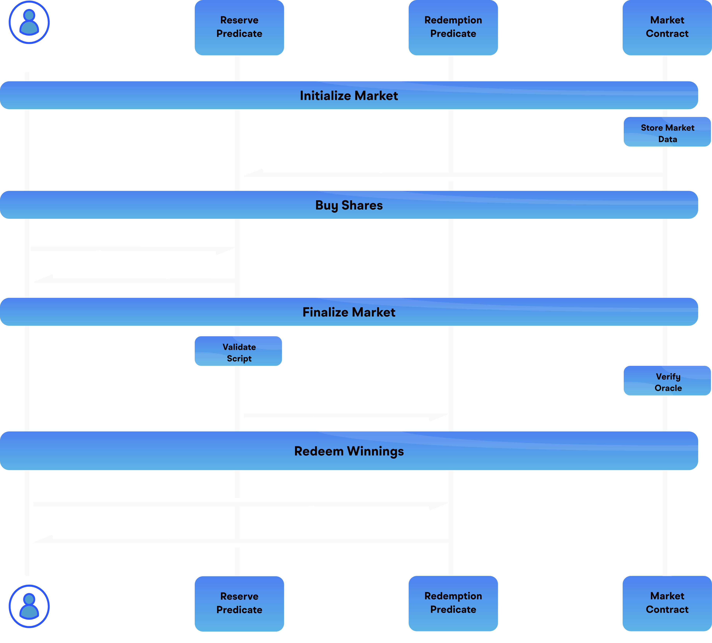

# Tan Theta Predicates

This repository contains predicates that are integral to the Tan Theta Protocol, enabling efficient order matching and liquidity sharing across decentralized exchanges (DEXs) and prediction markets. 

## What is Tan Theta?

[Tan Theta](https://docs.tantheta.io) is a protocol designed to resolve liquidity challenges and improve order matching in prediction markets and DEXs. It achieves this by providing a Universal Liquidity Layer, which aggregates liquidity across platforms, enhancing price discovery and trading efficiency.

### Predicates Overview

The predicates in this repository are designed to facilitate decentralized order matching.

#### Flow

## License

This repository is licensed under the [Business Source License 1.1](./LICENSE), with additional usage grants defined in the repo.

---

For more detailed documentation, visit the [Tan Theta Docs](https://docs.tantheta.io).